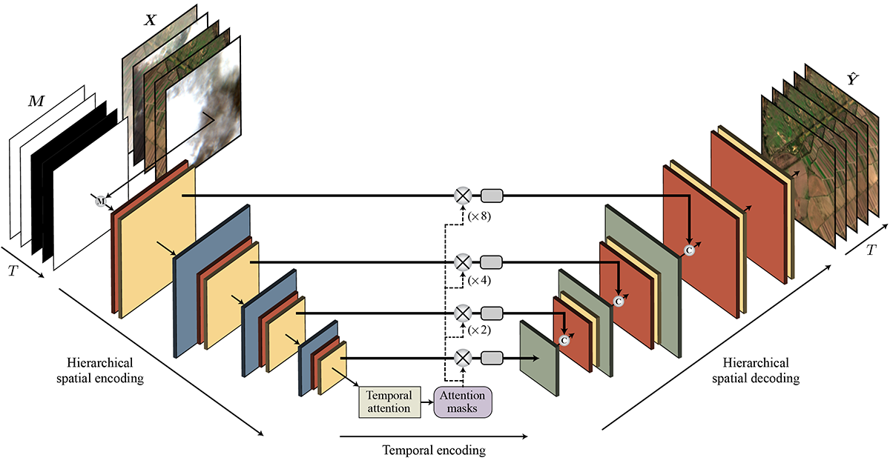

<p align="center">
<h1 align="center"> U-TILISE: A Sequence-to-sequence Model for Cloud Removal in Optical Satellite Time Series </h1>

<p align="center">
    <a <strong>Corinne Stucker</strong></a>,
    <a <strong>Vivien Sainte Fare Garnot</strong></a>,
    <a <strong>Konrad Schindler</strong></a>
</p>

<p align="center">
<a href="https://arxiv.org/abs/2305.13277"><strong>[ArXiv]</strong></a>
</p>
  
Satellite image time series in the optical and infrared spectrum suffer from frequent data gaps due to cloud cover, cloud shadows, and temporary sensor outages. It has been a long-standing problem of remote sensing research how to best reconstruct the missing pixel values and obtain complete, cloud-free image sequences. We approach that problem from the perspective of representation learning and develop U&#8209;TILISE, an efficient neural model that is able to implicitly capture spatio-temporal patterns of the spectral intensities, and that can therefore be trained to map a cloud-masked input sequence to a cloud-free output sequence. The model consists of a convolutional *spatial encoder* that maps each individual frame of the input sequence to a latent encoding; an attention-based *temporal encoder* that captures dependencies between those per-frame encodings and lets them exchange information along the time dimension; and a convolutional *spatial decoder* that decodes the latent embeddings back into multi-spectral images. We experimentally evaluate the proposed model on EarthNet2021, a dataset of Sentinel-2 time series acquired all over Europe, and demonstrate its superior ability to reconstruct the missing pixels. Compared to a standard interpolation baseline, it increases the PSNR by 1.8 dB at previously seen locations and by 1.3 dB at unseen locations.



## Training & Evaluation

**Code coming soon, stay tuned!**


## Citation
```bibtex
@article{stucker2023u,
  title={{U-TILISE}: A Sequence-to-sequence Model for Cloud Removal in Optical Satellite Time Series},
  author={Stucker, Corinne and Garnot, Vivien Sainte Fare and Schindler, Konrad},
  journal={arXiv preprint arXiv:2305.13277},
  year={2023}
}
```
